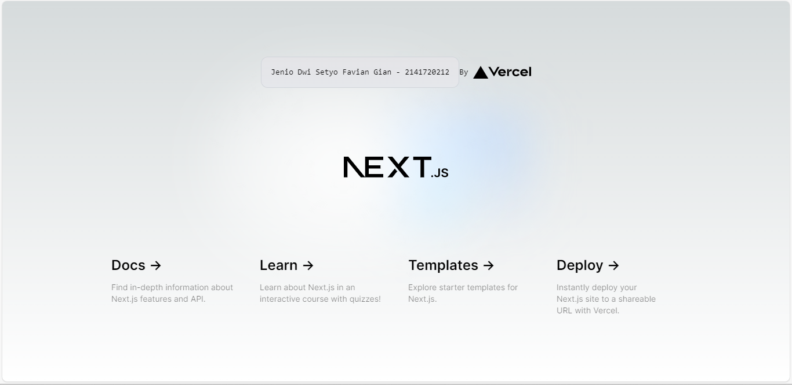

Nama    : Jenio Dwi Setyo Favian Gian
NIM     : 2141720212

# Praktikum: Membuat Project Pertama ReactJS
---
## Soal 1
Pada gambar tersebut, silakan Anda browsing apa yang dimaksud dengan:
- TypeScript
adalah sebuah bahasa pemrograman open-source yang dikembangkan oleh Microsoft. Ini merupakan sebuah superset dari JavaScript yang menambahkan fitur statis typing ke dalam bahasa tersebut.
- ESLint
adalah sebuah alat linting untuk JavaScript yang digunakan untuk menemukan dan memperbaiki pola kode yang tidak diinginkan atau kode yang tidak efisien.
- Tailwind CSS
adalah sebuah framework CSS yang memungkinkan pengembang untuk membangun antarmuka web dengan cepat dengan menggunakan sejumlah kelas CSS yang telah ditetapkan.
- App Router
digunakan pada sebuah bagian dari aplikasi web yang bertanggung jawab atas routing atau pengalihan pengguna dari satu halaman ke halaman lain dalam aplikasi tersebut. 
- Import alias
adalah cara untuk memberi nama alternatif kepada modul atau berkas yang diimpor dalam sebuah proyek. Ini memudahkan pengembang untuk merujuk ke modul tertentu dengan cara yang lebih singkat.

## Soal 2
Pada struktur project tersebut, jelaskan kegunaan folder dan file masing-masing tersebut!
- .git: Folder ini digunakan oleh sistem kontrol versi Git untuk menyimpan semua informasi terkait dengan repositori Git Anda. Folder ini berisi metadata, log, konfigurasi, dan riwayat perubahan yang terjadi dalam repositori Git.
- node_modules: Folder ini berisi semua paket dan dependensi yang dibutuhkan oleh proyek tersebut. Ketika Anda menginstal paket-paket menggunakan npm atau yarn, paket-paket tersebut akan diunduh dan disimpan di dalam folder
- public: Folder ini digunakan untuk menyimpan berkas-berkas statis seperti gambar, file CSS, file JavaScript, dan file lainnya yang akan digunakan dalam aplikasi web Anda. Berkas-berkas yang disimpan di dalam folder public ini dapat diakses secara langsung oleh browser tanpa perlu melalui proses kompilasi atau pengolahan oleh Next.js.
- src: Folder src tidak memiliki fungsi khusus yang ditentukan oleh Next.js. Folder src biasanya digunakan untuk menyimpan berkas-berkas kode sumber aplikasi web, seperti komponen React, halaman, utilitas, layanan, dan berkas-berkas lain yang dibutuhkan dalam pengembangan aplikasi.
- eslintrc.json: File ini digunakan untuk mengkonfigurasi ESLint, yaitu alat linting JavaScript yang membantu dalam mengidentifikasi dan memperbaiki potensi kesalahan dalam kode JavaScript
- .gitignore: File ini digunakan untuk menentukan berkas-berkas atau folder-folde yang tidak ingin diikutsertakan dalam repositori Git.
- next-env.d.ts: File ini khusus untuk TypeScript dan digunakan untuk mendeklarasikan enviroment variable yang akan digunakan dalam komponen dan API Routes.
- next.config.mjs: File ini digunakan untuk mengkonfigurasi berbagai pengaturan khusus dalam proyek Next.js, seperti pengaturan server, pengaturan webpack, pengaturan routing, dan pengaturan lainnya yang tidak dapat diatur melalui opsi konfigurasi bawaan Next.js.
- package-lock.json: File ini dihasilkan dari file package.json dan berisi versi spesifik dari semua dependensi yang diinstal.
- package.json: Fle ini berisi informasi penting seperti nama project, deskripsi, dependensi, skrip, dan pengaturan lainnya, digunakan untuk menginstal dan mengelola dependensi, menjalankan skrip build dan pengembangan, dan menentukan konfigurasi untuk tools seperti ESLint dan Prettier.
- postcss.config.js: File ini digunakan untuk mengkonfigurasi PostCSS, sebuah tool untuk memproses CSS
- README.md: File ini adalah dokumen "Read Me" yang berisi informasi tentang project anda, digunakan untuk menjelaskan cara instalasi, penggunaan, dan cara kontribusi ke project.
- tailwind.config.ts: File ini digunakan untuk mengkonfigurasi Tailwind CSS, sebuah utility-first framework CSS.
- tsconfig.json: File ini digunakan untuk mengkonfigurasi TypeScript, sebuah superset dari JavaScript yang menambahkan fitur seperti typing dan type checking

## Soal 3
Gantilah teks pada bagian atas dengan Nama - NIM Anda.
 (Jenio Dwi Setyo Favian Gian - 2141720212)